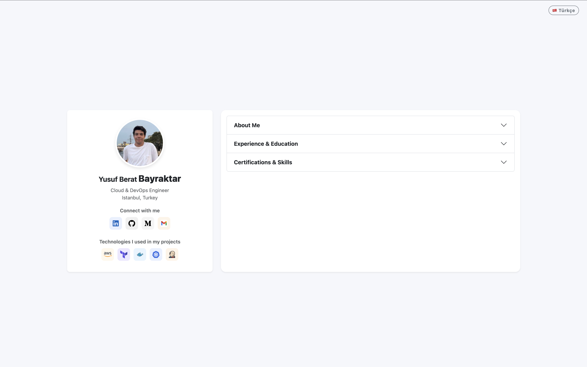
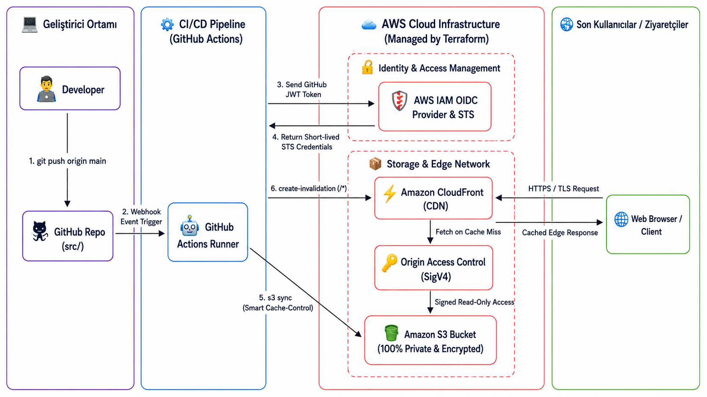
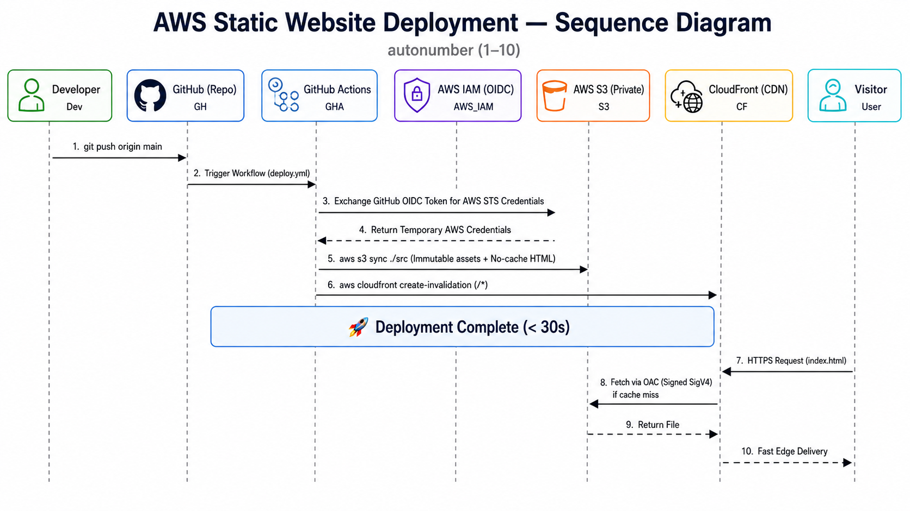

## About The Project

The frontend is built using standard HTML5, CSS3, JavaScript, and Bootstrap 5. The hosting, security, caching, and automated deployment pipelines are provisioned on AWS using Infrastructure as Code (Terraform) and GitHub Actions CI/CD.



---

## System Architecture & Request Flow

### 1. System Architecture & Security Flow


### 2. CI/CD & Request Lifecycle


---

## Architectural & Security Decisions

### Private S3 with CloudFront Origin Access Control (OAC)
The S3 bucket is completely restricted from public internet access via S3 Public Access Blocks (`block_public_acls`, `block_public_policy`). Content can only be fetched by Amazon CloudFront using SigV4-signed requests through Origin Access Control (OAC). This prevents direct S3 exposure, offloads DDoS protection and TLS termination to edge locations, and enforces central access policies.

### Keyless Authentication with IAM OpenID Connect (OIDC)
Static, long-lived AWS Access Keys are not stored in GitHub Secrets. Instead, GitHub Actions authenticates directly with AWS IAM via OpenID Connect (OIDC). On each pipeline run, short-lived temporary credentials are generated through AWS STS and scoped strictly to the deployment workflow.

### Tiered Cache Strategy (Cache-Control)
Files are uploaded to S3 with distinct HTTP caching headers depending on their content type:
* **Static Assets (`.css`, `.js`, images, fonts):** Deployed with `Cache-Control: public, max-age=31536000, immutable` for 1-year persistent caching across CloudFront edge locations and client browsers.
* **Entry Point (`index.html`):** Deployed with `Cache-Control: public, max-age=0, must-revalidate` to ensure immediate propagation of frontend updates. A CloudFront cache invalidation (`/*`) is triggered at the end of each deployment to purge cached entry points globally.

---

## Directory Structure

```text
.
├── .github/
│   └── workflows/
│       ├── deploy.yml              # CI/CD: OIDC Auth -> S3 Sync -> CloudFront Invalidation
│       └── terraform-lint.yml      # CI: Terraform formatting and validation checks
│
├── infra/                          # Infrastructure as Code (Terraform)
│   ├── main.tf                     # S3 (Private), CloudFront, OAC, Bucket Policy
│   ├── variables.tf                # Input variables (region, bucket name, tags)
│   ├── outputs.tf                  # CloudFront URL, Distribution ID, S3 Name
│   ├── backend.tf.example          # Remote state & DynamoDB state locking 
│   └── terraform.tfvars.example    # variable values
│
├── src/                            # Static Website Source Files
│   ├── css/
│   │   └── index.css
│   ├── image/
│   │   └── ... (Images, favicon, icons)
│   ├── js/
│   │   ├── icon.js
│   │   ├── index.js
│   │   └── translations.js
│   └── index.html
│
├── docs/                           
│   ├── architecture.png
│   ├── kartvizit.png
│   └── sequence-diagram.png
│
├── .gitignore                      
└── README.md                       
```

---

## Infrastructure & Setup Guide

### 1. Prerequisites
* AWS CLI (Configured with appropriate administrative permissions)
* Terraform >= 1.5.0

```bash
aws sts get-caller-identity
terraform -version
```

### 2. Provisioning Infrastructure with Terraform

1. Navigate to the `infra/` directory and create the variable definition file:
   ```bash
   cd infra
   cp terraform.tfvars.example terraform.tfvars
   ```

2. Update `terraform.tfvars` with your project parameters, then initialize and apply:
   ```bash
   terraform init
   terraform plan
   terraform apply
   ```

3. Note down the outputs:
   * `s3_bucket_name`
   * `cloudfront_distribution_id`
   * `website_url`

### 3. Remote State & DynamoDB State Locking

For team environments and CI/CD consistency, configure remote state storage with state locking:

1. Create an S3 bucket (with versioning and encryption enabled) and a DynamoDB table with partition key `LockID` (String).
2. Enable `infra/backend.tf`:
   ```bash
   cd infra
   cp backend.tf.example backend.tf
   ```
3. Migrate local state to the remote backend:
   ```bash
   terraform init -migrate-state
   ```

---

## CI/CD & AWS IAM OIDC Configuration

To allow GitHub Actions to authenticate with AWS without long-lived credentials, configure the following IAM resources:

### 1. IAM OpenID Connect Identity Provider
* **Provider Type:** OpenID Connect
* **Provider URL:** `https://token.actions.githubusercontent.com`
* **Audience:** `sts.amazonaws.com`

### 2. IAM Role Trust Policy
Create an IAM Role with the following Trust Relationship, substituting your GitHub organization/username and repository name:

```json
{
  "Version": "2012-10-17",
  "Statement": [
    {
      "Effect": "Allow",
      "Principal": {
        "Federated": "arn:aws:iam::<ACCOUNT_ID>:oidc-provider/token.actions.githubusercontent.com"
      },
      "Action": "sts:AssumeRoleWithWebIdentity",
      "Condition": {
        "StringEquals": {
          "token.actions.githubusercontent.com:aud": "sts.amazonaws.com"
        },
        "StringLike": {
          "token.actions.githubusercontent.com:sub": "repo:<GITHUB_USERNAME>/<REPO_NAME>:*"
        }
      }
    }
  ]
}
```

### 3. IAM Role Permission Policy
Attach a policy granting the role permissions to synchronize files to S3 and invalidate CloudFront:

```json
{
  "Version": "2012-10-17",
  "Statement": [
    {
      "Effect": "Allow",
      "Action": [
        "s3:PutObject",
        "s3:GetObject",
        "s3:ListBucket",
        "s3:DeleteObject"
      ],
      "Resource": [
        "arn:aws:s3:::<S3_BUCKET_NAME>",
        "arn:aws:s3:::<S3_BUCKET_NAME>/*"
      ]
    },
    {
      "Effect": "Allow",
      "Action": [
        "cloudfront:CreateInvalidation"
      ],
      "Resource": "arn:aws:cloudfront::<ACCOUNT_ID>:distribution/<DISTRIBUTION_ID>"
    }
  ]
}
```

### 4. GitHub Repository Secrets
Define the following secrets under **Settings > Secrets and variables > Actions**:

| Secret Name | Description | Example Value |
| :--- | :--- | :--- |
| `AWS_ROLE_ARN` | IAM OIDC Role ARN | `arn:aws:iam::123456789012:role/github-actions-portfolio-deploy` |
| `AWS_REGION` | Target AWS Region | `eu-central-1` |
| `AWS_S3_BUCKET` | S3 bucket name from Terraform output | `portfolio-production-bucket-xyz` |
| `CLOUDFRONT_DISTRIBUTION_ID` | CloudFront Distribution ID from Terraform output | `E1A2B3C4D5E6F7` |

---

## Deployment Lifecycle

Once configured, the automation pipeline operates as follows:

1. A push to the `main` branch affecting files in `src/` triggers the `deploy.yml` workflow.
2. GitHub Actions requests short-lived AWS STS credentials via OIDC authentication.
3. Assets are synchronized to S3 with cache headers configured for immutable assets and instant revalidation for HTML.
4. A CloudFront cache invalidation is executed (`/*`) to propagate updates across edge locations immediately.
5. Infrastructure changes in `infra/` trigger `terraform-lint.yml` to validate syntax, formatting, and configuration correctness.

---

## Contact

**Yusuf Berat Bayraktar** — Cloud & DevOps Engineer

<p align="left">
  <a href="https://ybayraktarb.com/" target="_blank">
    
  </a>
  <a href="https://linkedin.com/in/yusufberatbayraktar" target="_blank">
    
  </a>
  <a href="https://medium.com/@ybayraktarb" target="_blank">
    
  </a>
</p>
